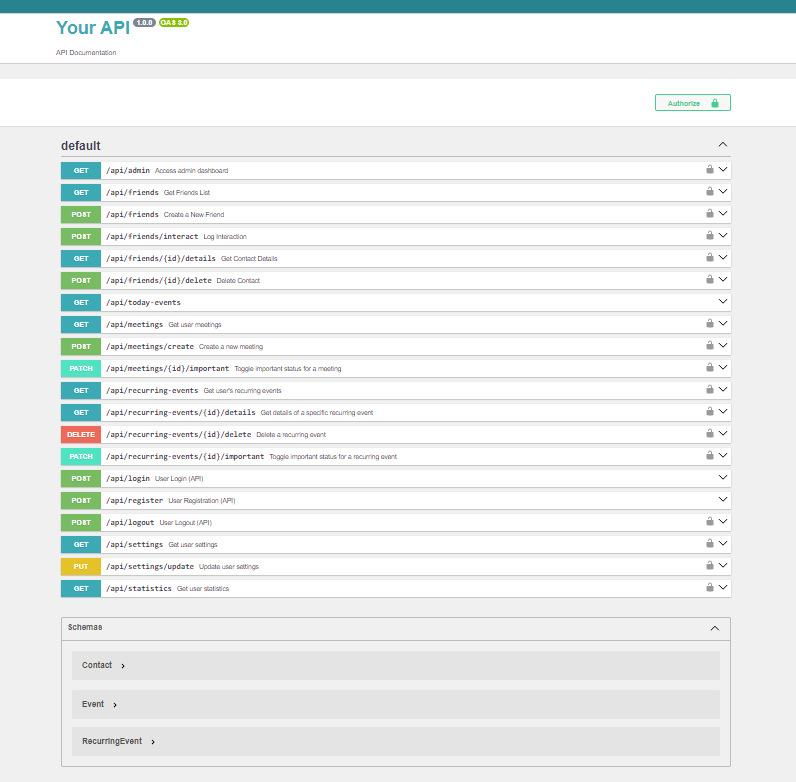
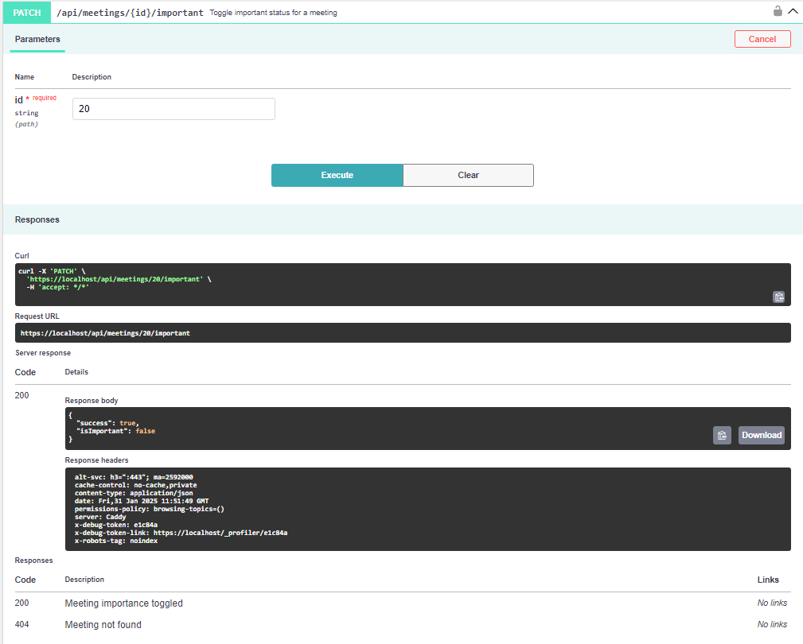

# RelationTracker – Opis projektu i jego realizacji

## Spis treści
1. [Opis projektu](#opis-projektu)
2. [Główne funkcjonalności](#główne-funkcjonalności)
3. [Wybór frameworka – Symfony](#wybór-frameworka--symfony)
4. [Architektura projektu](#architektura-projektu)
5. [ERD (Entity Relationship Diagram)](#erd-entity-relationship-diagram)
6. [ORM (Object-Relational Mapping)](#orm-object-relational-mapping)
7. [Ekrany aplikacji RelationTracker](#ekrany-aplikacji-relationtracker)
    - [Rejestracja i logowanie (JWT Token)](#rejestracja-i-logowanie-jwt-token)
    - [Dashboard – Główna strona użytkownika](#dashboard--główna-strona-użytkownika)
    - [Dodawanie i edycja kontaktów](#dodawanie-i-edycja-kontaktów)
    - [Zarządzanie wydarzeniami](#zarządzanie-wydarzeniami)
    - [Sekcja „Important” – Priorytetowe wydarzenia](#sekcja-important--priorytetowe-wydarzenia)
    - [Sekcja „Statistics” – Analiza interakcji](#sekcja-statistics--analiza-interakcji)
    - [Ustawienia konta (Settings)](#ustawienia-konta-settings)
    - [Resetowanie hasła (RabbitMQ)](#resetowanie-hasła-rabbitmq)
    - [Dokumentacja API - Swagger](#dokumentacja-api--swagger)
8. [Technologie użyte w projekcie](#technologie-użyte-w-projekcie)
9. [Potencjalny rozwój aplikacji](#potencjalny-rozwój-aplikacji)
10. [Twórca projektu](#twórca-projektu)

---

## Opis projektu
RelationTracker to aplikacja do zarządzania relacjami międzyludzkimi, umożliwiająca użytkownikom przechowywanie kontaktów, śledzenie interakcji oraz organizowanie wydarzeń i przypomnień. Głównym celem systemu jest ułatwienie budowania i pielęgnowania relacji poprzez automatyzację powiadomień, monitorowanie aktywności i planowanie interakcji.

## Główne funkcjonalności
- Autoryzacja i uwierzytelnianie użytkowników (JWT)
- Zarządzanie kontaktami
- Śledzenie interakcji z kontaktami
- Zarządzanie wydarzeniami i przypomnieniami
- Wysyłanie resetu hasła poprzez e-mail (Mailer, RabbitMQ)
- Interfejs REST API
- Dokumentacja API (Swagger)
- Backup i zarządzanie bazą danych
- Obsługa RabbitMQ do procesów asynchronicznych

## Wybór frameworka – Symfony
W projekcie został wykorzystany **Symfony**, ponieważ:

-  **Stabilność i skalowalność** – sprawdzona architektura dla dużych aplikacji.
-  **Wbudowana obsługa ORM (Doctrine)** – łatwa integracja z bazą danych.
-  **Obsługa REST API** – dedykowane komponenty dla API (Serializer, API Platform).
-  **Bezpieczeństwo** – wbudowana obsługa JWT i CSRF.
-  **Wsparcie dla kolejek** – obsługa **RabbitMQ** poprzez Symfony Messenger.
-  **Dobre narzędzia debugowania** – WebProfiler i Debug Toolbar.

## Architektura projektu
RelationTracker został zaprojektowany zgodnie z MVC (**Model-View-Controller**) oraz wykorzystuje wzorce **DDD** (*Domain-Driven Design*) i **CQRS** (*Command Query Responsibility Segregation*).

- **Frontend (Twig/JS)**
    - Komunikuje się z API poprzez REST.
    - Odpowiada za interfejs użytkownika i interakcję z danymi.

- **Backend (Symfony)**
    - Obsługuje logikę biznesową.
    - Udostępnia REST API do zarządzania kontaktami, wydarzeniami i interakcjami.
    - Obsługuje RabbitMQ do asynchronicznych operacji (resetowanie hasła, powiadomienia e-mail).
    - Korzysta z Doctrine ORM do interakcji z bazą danych.

- **RabbitMQ (kolejkowanie wiadomości)**
    - Obsługuje asynchroniczne przetwarzanie (np. wysyłanie e-maili).
    - Pośredniczy w komunikacji między backendem a usługami pomocniczymi.

- **Baza danych (PostgreSQL)**
    - Przechowuje użytkowników, kontakty, interakcje i wydarzenia.
    - Relacyjny model danych zarządzany przez Doctrine ORM.

- **Swagger API**
    - Interaktywna dokumentacja API.
    - Pozwala na testowanie endpointów REST.

---

## ERD (Entity Relationship Diagram)

## Główne encje i ich znaczenie

### **User (Użytkownik)**
- Przechowuje informacje o użytkownikach systemu, w tym **email, hasło, role** oraz **reset_token** używany do resetowania hasła.
- Każdy użytkownik może posiadać wiele **kontaktów, wydarzeń** oraz.

### **Contact (Kontakt)**
- Zawiera dane dotyczące kontaktów użytkownika, takie jak **email, numer telefonu, data urodzenia, adres, notatki oraz relacja**.
- Każdy kontakt przypisany jest do jednego użytkownika (**user_name_id**).

### **Event (Wydarzenie)**
- Odpowiada za **jednorazowe wydarzenia**, które są przypisane do użytkownika.
- Może zawierać **tytuł, opis, datę** i informacje o **ważności wydarzenia**.

### **Recurring Event (Wydarzenie cykliczne)**
- Odpowiada za **wydarzenia powtarzające się**, takie jak coroczne urodziny czy regularne spotkania.
- Posiada właściwość **recurrence_pattern**, określającą częstotliwość powtarzania wydarzenia.

### **Interaction (Interakcje z kontaktami)**
- Rejestruje, **kiedy użytkownik ostatnio wchodził w interakcję** z danym kontaktem.
- Przechowuje informacje o **dacie interakcji** i osobie inicjującej (**self** lub **friend**).

### **Reminder (Przypomnienia)**
- Służy do przechowywania **przypomnień** powiązanych z wydarzeniami i kontaktami.
- Może zawierać **wiadomość przypomnienia** oraz **datę przypomnienia**.

### **Setting (Ustawienia użytkownika)**
- Pozwala użytkownikowi personalizować konto, w tym:
    - **Włączać powiadomienia**
    - **Tryb ciemny**
    - **Zmieniać rozmiar czcionki**

### **Tabela: doctrine_migration_versions**
- Po uruchomieniu migracji, Doctrine zapisuje nową wersję migracji w tej tabeli.
- Gdy uruchomiona zostanie kolejna migracja, Doctrine sprawdza, jakie wersje zostały już wykonane.
- Dzięki temu system wie, które zmiany zostały już zaaplikowane, co zapobiega ponownemu ich uruchomieniu.

---

## **Relacje między encjami**

- **Każdy użytkownik** może mieć **wielu kontaktów** (**1:N**), ale **każdy kontakt** należy do **jednego użytkownika**.
- **Każdy użytkownik** może mieć **wiele wydarzeń** (**1:N**), zarówno **jednorazowych**, jak i **cyklicznych**.
- **Każde wydarzenie** może mieć **wielu uczestników** (**N:M**) poprzez **tabelę pośrednią `event_contact`**.
- **Interakcje** są rejestrowane dla kontaktów (**1:N**) – kontakt może mieć wiele zapisanych interakcji w historii.
- **Użytkownik** może mieć **ustawienia konta** (**1:1**).

## ORM (Object-Relational Mapping)
**ORM** (*Object-Relational Mapping*) to technika mapowania obiektowego, która pozwala na operowanie danymi w bazie danych w sposób obiektowy, zamiast bezpośredniego używania zapytań SQL. W **RelationTracker** wykorzystujemy **Doctrine ORM**, który:

- Mapuje encje na tabele w bazie danych.
- Zarządza relacjami między encjami.
- Automatycznie generuje schemat bazy danych.
- Zapewnia abstrakcję SQL poprzez metody PHP.
- Dba o spójność danych i walidację.

---

## Ekrany aplikacji RelationTracker

### 1. Rejestracja i logowanie (JWT Token)

### 2. Dashboard – Główna strona użytkownika

### 3. Dodawanie i edycja kontaktów

### 4. Zarządzanie wydarzeniami

### 5. Sekcja „Important” – Priorytetowe wydarzenia

### 6. Sekcja „Statistics” – Analiza interakcji

### 7. Ustawienia konta (Settings)

### 8. Resetowanie hasła (RabbitMQ)

### 9. Dokumentacja API - Swagger

---

## Technologie użyte w projekcie
- Symfony – backend
- Twig – frontend
- Doctrine ORM – baza danych
- PostgreSQL – relacyjna baza danych
- RabbitMQ – kolejkowanie wiadomości
- JWT – autoryzacja użytkowników
- Swagger – dokumentacja API
- **Docker** – środowisko uruchomieniowe ([Symfony-Docker](https://github.com/dunglas/symfony-docker))

---

## Potencjalny rozwój aplikacji
- Obsługa wielu języków (i18n).
- Lepsze powiadomienia push/email.
- Zaawansowana analiza statystyk użytkownika.

---

## Twórca projektu
 **Rafał Szczyrbak**

Dziękuję za zapoznanie się z dokumentacją projektu!
